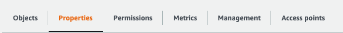
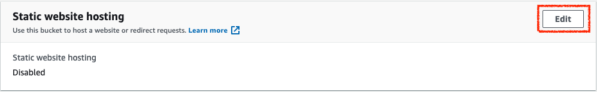
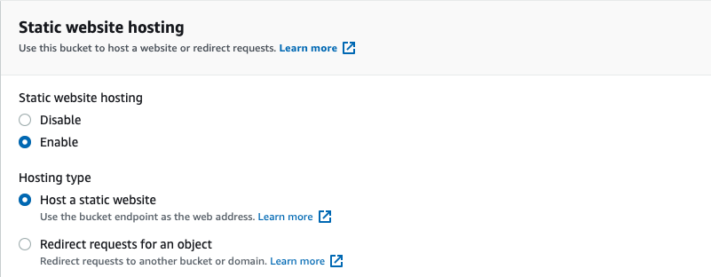
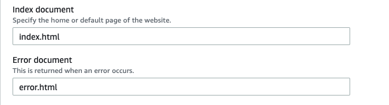
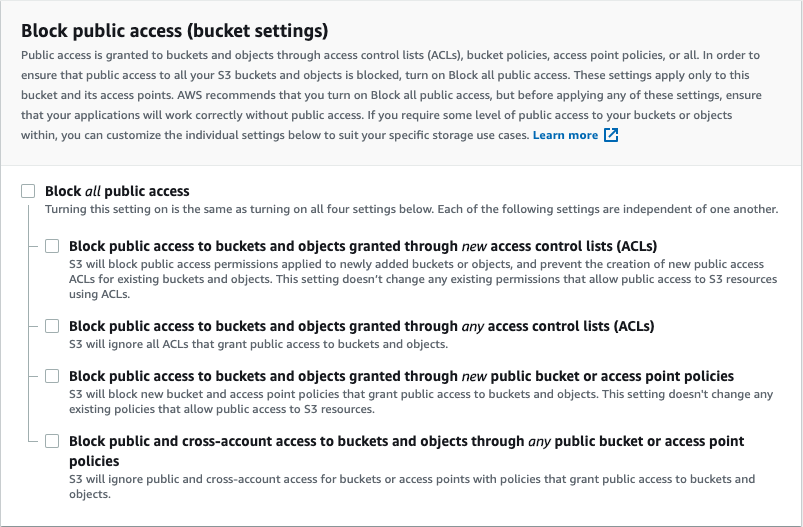

# Static Website Hosting


## Object

Understand how to host a static website on S3

## Step

1. Open the S3 console

2. Create a new bucket or choose the bucket

    *If you want to use Route 53 to config the URL of this static website, the bucket name must exactly match your domain name.*

    Upload index.html to this bucket

3. Choose **Properties**  > Find **Static website hosting** > Click **Edit**

    

    

4. Enable **Static website hosting**

   - In **Index document**, enter your index html file name, typically *index.html*

   - In **Error document**, enter your error html file name, typically *error.html*

   Then, choose **Save changes**

   

   

5. Choose **Permissions** > Click **Edit** > Clear Block all public access and then choose **Save**

    In the comfirmation box, enter *confirm* and then choose **Confirm**

    

6. Choose **Permisssions** > Chooose **Bucket Policy** > Click **Edit**

    Paste the following policy in the editor:

   ```
   {
       "Version": "2012-10-17",
       "Statement": [
           {
               "Sid": "PublicReadGetObject",
               "Effect": "Allow",
               "Principal": "*",
               "Action": [
                   "s3:GetObject"
               ],
               "Resource": [
                   "arn:aws:s3:::example.com/*"
               ]
           }
       ]
   }
   ```

   Update the **Resource** to replace "example.com" with your bucket name and then choose **Save changes**

7. Test your static website with the folloing url:

  http://**bucket-name**.s3-website.**Region**.amazonaws.com

  - bucket-name: replace with your bucket name
  - Region: replace with the region that your bucket placed

  For example:  http://lightda-workshop.s3-website.ap-northeast-1.amazonaws.com

## References:

- https://docs.aws.amazon.com/zh_tw/AmazonS3/latest/user-guide/static-website-hosting.html

- https://docs.aws.amazon.com/AmazonS3/latest/dev/website-hosting-custom-domain-walkthrough.html

- https://github.com/azole/docker-2048

